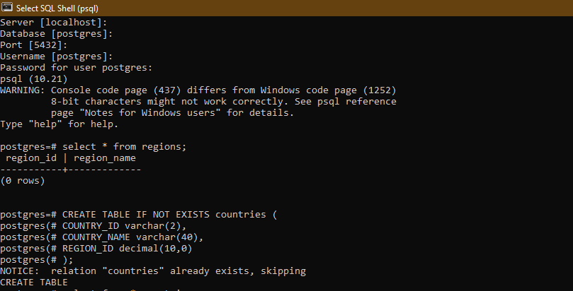
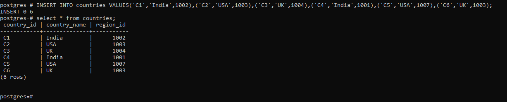
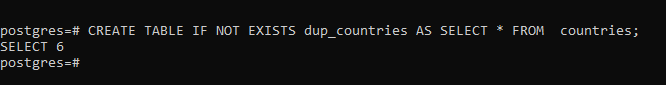
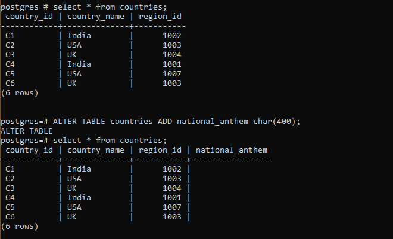
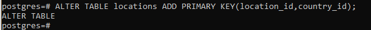
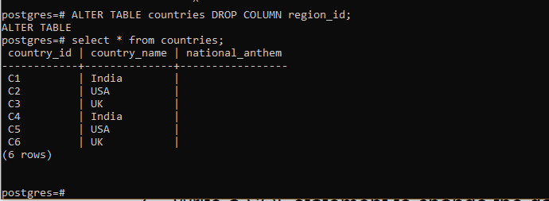
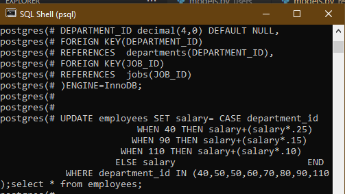

# SQL

1. Write a SQL statement to create a simple tables countries and regions.
Countries table includes columns country_id, country_name and region_id
which already exist.

2. Write a SQL statement insert rows from the country_new table to countries
table.

3. Write a SQL statement to create a duplicate copy of countries table
including structure and data by name dup_countries.

4. Write a SQL statement to add column national_anthem (maximum 400
characters) can be empty

5. Write an SQL statement to add a primary key for a combination of columns
region_id and country_id.

6. Write a SQL statement to drop any existing foreign key from countries
table

7. Write a SQL statement to change the data type of the column
national_anthem to text in the table locations.

8. Write a SQL statement to increase the salary of employees under the
department 40, 90 and 110 according to the company rules that, the salary
will be increased by 25% of the department 40, 15% for department 90 and
10% of the department 110 and the rest of the department will remain
same.

9. Write a SQL statement to create a table employees including columns
employee_id, first_name, last_name, job_id, salary and make sure that,
the employee_id column does not contain any duplicate value at the time
of insertion, and the foreign key column job_id, referenced by the column
job_id of jobs table, can contain only those values which exist in the jobs
table. The specialty of the statement is that, The ON DELETE NO ACTION
and the ON UPDATE NO ACTION actions will reject the deletion and any
updates.

